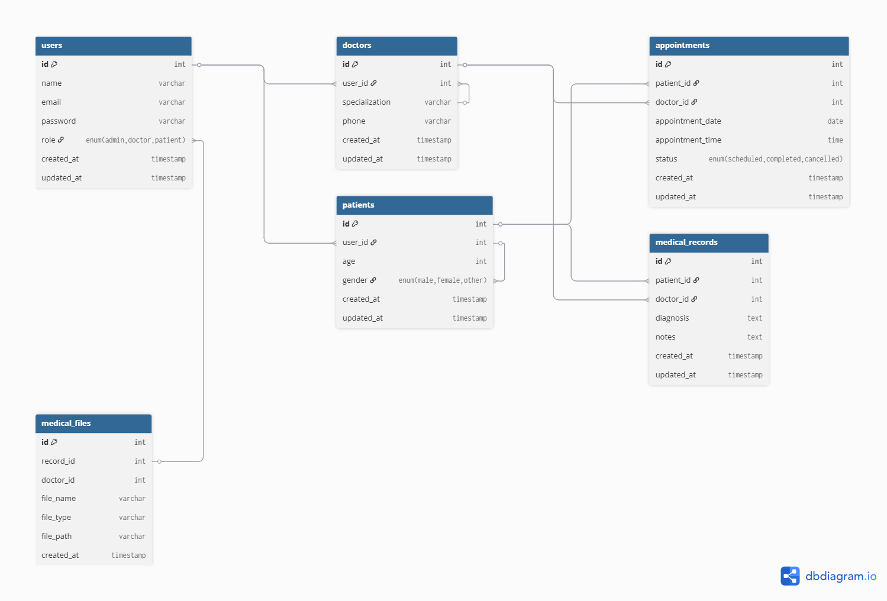
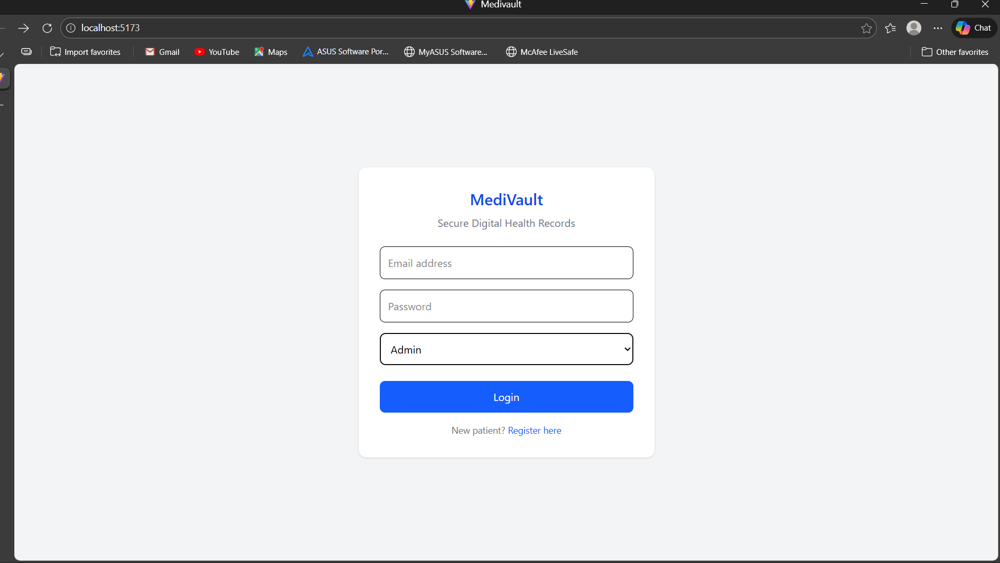
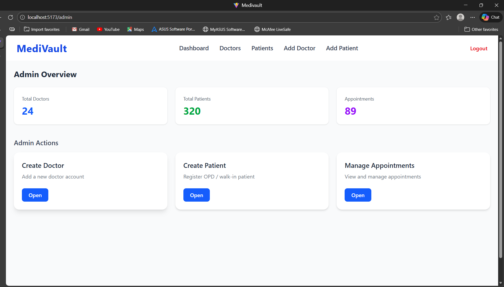
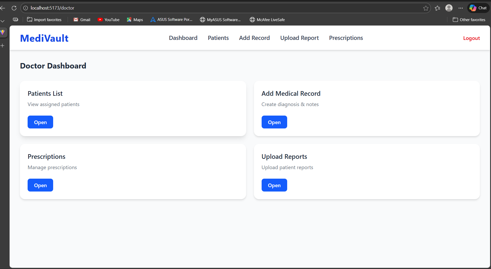
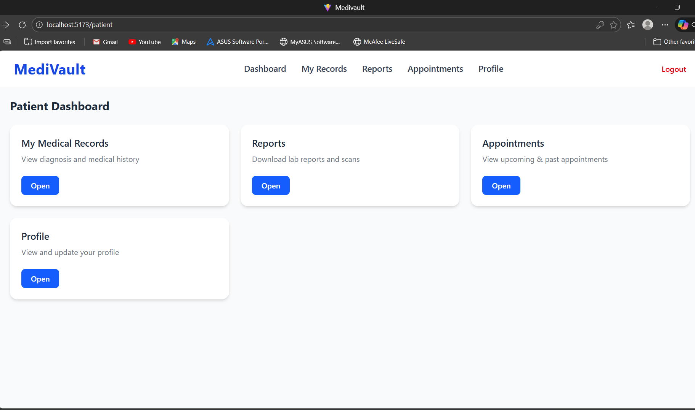

 # MediVault 

MediVault is a healthcare management system that helps hospitals manage
patients, doctors, and medical records digitally.

🏥 MediVault – Digital Health Record System

MediVault is a role-based web application for managing digital health records (EHR) securely.
It provides separate dashboards for Admin, Doctor, and Patient, ensuring proper access control and real-world hospital workflow simulation.

Features
* Role-Based Access*
 -Admin Dashboard
 -Doctor Dashboard
 -Patient Dashboard

* Admin Module *

View system overview (doctors, patients, appointments)
Create Doctor accounts
Create Patient accounts (OPD / walk-in)
Manage appointments

🩺 Doctor Module**
-View assigned patients
-Add medical records
-Upload medical report
-Manage prescriptions

👤 Patient Module**
 -View medical records (read-only)
 -Download reports
 -View appointments
 -Manage profile

**🖥️ Tech Stack**
Frontend
React.js (Vite)
Tailwind CSS
React Router DOM

**Backend (Planned)**
Node.js
Express.js
MYSQL
JWT Authentication

📁 **Project Structure**

src/
│── components/
│   ├── DashboardNavbar.jsx
│   ├── DashboardCard.jsx
│
│── pages/
│   ├── admin/
│   ├── doctor/
│   ├── patient/
│
│── App.jsx
│── main.jsx

##  Screenshots

### Database Schema 
    

### Login

### Admin Dashboard

### Doctor Dashboard

### Patient Dashboard

🧠** Design Decisions**

UI built first with dummy data

Reusable components (Navbar, Cards)

Clean separation of roles

Backend-ready routing structure

Patient medical records are read-only (doctor-controlled)

** Future Improvements**

JWT Authentication

Role-based route protection

Real backend API integration

Search & filters

File upload with cloud storage

Audit logs for medical record access

** Author **

Prasad Vijay Kakde
Third Engineering Student | AIML
Frontend & Backend Enthusiast

